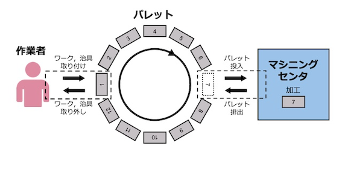
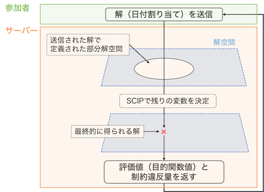
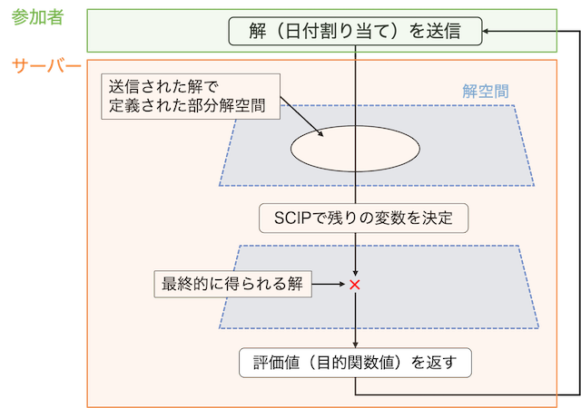

<div align=center>

# 分析記録

</div>

> 自動化が進んだ製造工場における機械加工スケジューリング問題
> 人手不足を補うために，デジタル技術を活用した生産工程の自動化が進められています．
> しかし，作業者と自動処理可能な機械が混在する実際の製造現場では，作業者の休憩時間や機械の稼働時間など様々な制約が存在します．
> 良質なスケジュールの導出を目指してもらいます．



> マシニングセンタと呼ばれる加工機械が加工対象物（ワーク）の加工を行い，作業者はワークを固定する台（パレット）にワークの取り付け/取り外しを行います．マシニングセンタの前にはパレットが12個設置されています．各パレットにはそれぞれワークを1つ取り付けることができます．
> ワークは以下の手順で処理されます．
> - ワークをパレットに取り付ける（作業者）
> - ワークを加工する（マシニングセンタ）
> - ワークをパレットから取り外す（作業者）

作業者：作業できない時間がある
- 10:00-10:10
- 12:00-12:45
- 15:00-15:15
- 17:00-翌09:00

```mermaid
gantt
    title work
    dateFormat  HH:mm
    axisFormat %H:%M

    section 作業者
    作業 :a1 ,09:00, 1h
    作業 :a2 ,10:10 ,110m
    作業 :a3 ,12:45, 135m
    作業 :a4 ,15:15, 105m

    section マシニングセンタ
    作業    :b1 , 09:00 ,24h
```



> ワークをパレットに取り付ける際，治具と呼ばれるワークを固定する器具が必要です．治具はワークごとに使えるものが決まっています．治具の交換はパレットにワークを取り付ける際に行い，45分余分にかかります．
> ワークには品番が存在し，同一パレット上でワークを交換する際，ワークの品番が異なる場合は10分の段取り替え時間が発生します．治具を交換する場合は，この段取り替え時間は発生しません．

-> これは、ジョブショップスケジューリング問題と言える。

## ジョブショップ・スケジューリング問題(Job-shop Scheduling Problem: JSP)

// Todo

---

<div align=center>

## 単目的部門

https://ec-comp.jpnsec.org/ja/matches/93

</div>

- 単目的部門との変更点：
> 変更部分はメイクスパンを目的関数に加え，納期制約を削除，作業者が残業できるようにした

### 評価指標

以下のルールに従って得点をつけていく

```diff
+ 納期余裕
- 納期遅れ
```

### 設計変数

以下を設計変数として最適化する

- 作業の日付割り当て
- SCIPのタイムアウト時間



---

<div align=center>

## 多目的部門

https://ec-comp.jpnsec.org/ja/matches/97

</div>

### 評価指標

以下のルールに従って得点をつけていく

```diff
+ 納期余裕
- メイクスパン(生産スケジューラでいうところの作業開始から作業終了までの時間)
- 納期遅れ
- 残業時間
```

### 設計変数

- 作業の日付割り当て
- 目的関数の重み
- SCIPのタイムアウト時間


